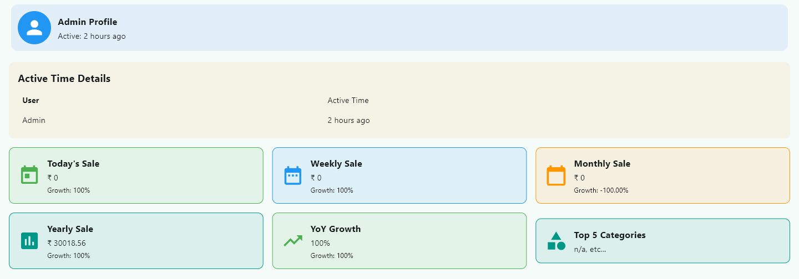
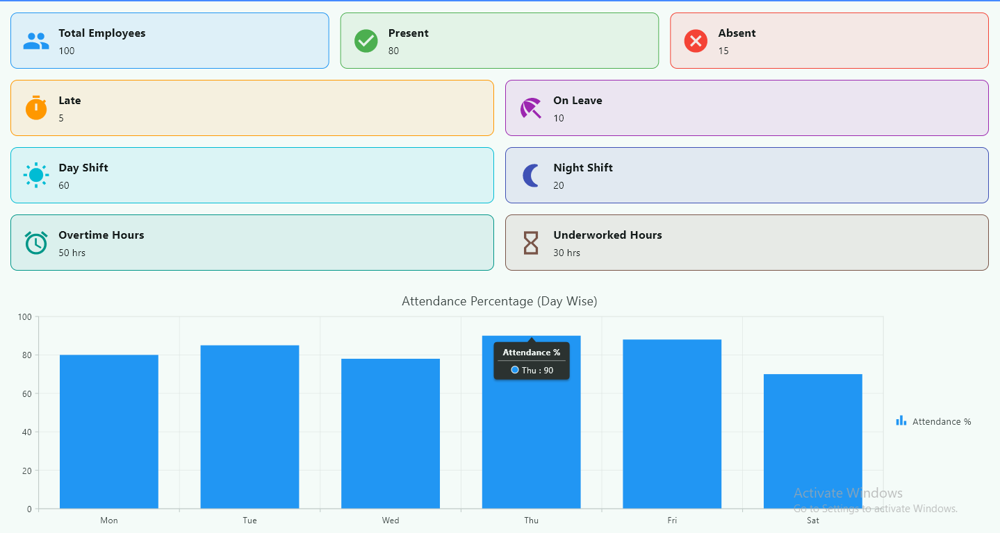
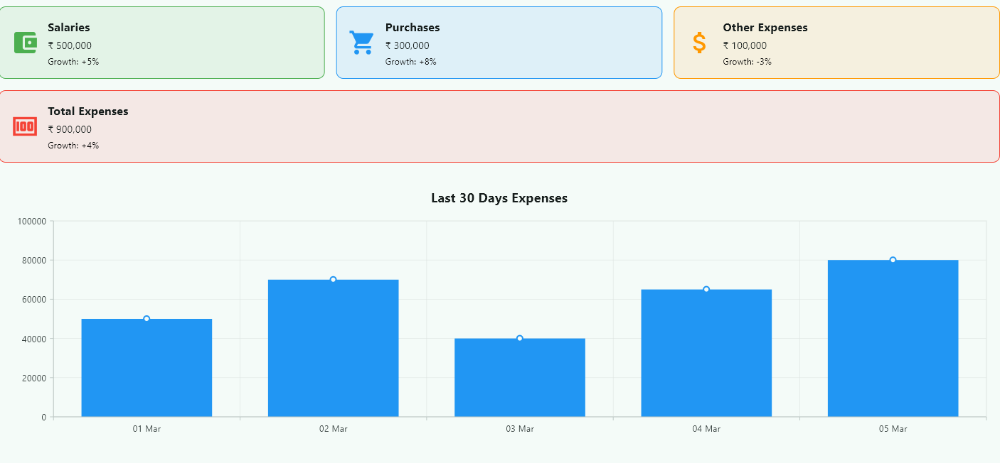
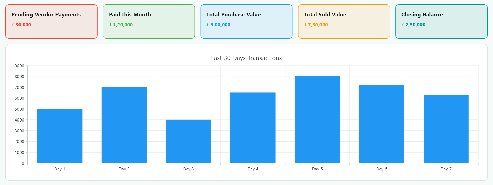
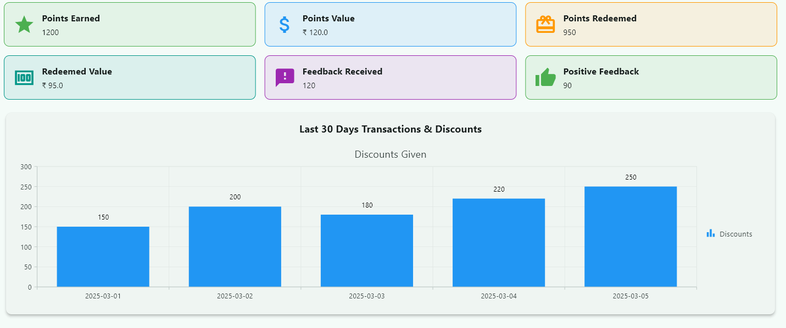

# **Point of Sale System**  

A **Flutter-based** Point of Sale (POS) system for **restaurant billing, order management, and inventory tracking**.

## **🚀 Join the Revolution in Restaurant Software!**  

This project aims to revolutionize restaurant management with an **open-source, community-driven POS system**. Whether you're a developer, a restaurant owner, or a tech enthusiast, your contributions can help shape the future of restaurant software!  

🛠️ **We need your help** to add innovative features, improve performance, and make this the go-to solution for restaurants worldwide.  

**💡 Let's build the future of restaurant POS together!** 💡

### Admin Dashboard
The Admin Dashboard provides an overview of the restaurant’s performance, sales trends, and user activity. From here, admins can manage staff, update settings, and monitor real-time reports.



### Attendance Dashboard
The Attendance Dashboard helps track employee attendance, work hours, late arrivals, and absences. It provides detailed reports for payroll processing and staff management.



### Expenses Dashboard
The Expenses Dashboard allows restaurant owners to track daily, weekly, and monthly expenses. It helps in managing operational costs, analyzing spending trends, and ensuring financial stability.



### Inventory Dashboard
The Inventory Dashboard helps restaurant managers monitor stock levels, track ingredient usage, and set reorder alerts. It ensures smooth kitchen operations by preventing stock shortages or overstocking.



### loyalty Dashboard
The Loyalty Dashboard enables businesses to manage customer loyalty programs. It helps in tracking reward points, customer engagement, and promotions to retain customers and boost sales.



---

## **Getting Started**  

This project serves as the starting point for your **Point of Sale** Flutter application. To get up and running, follow the instructions below.

### **Prerequisites**  

Before you begin, ensure you have the following installed:  
- **Flutter SDK**: Install Flutter from [Flutter Installation Guide](https://flutter.dev/docs/get-started/install).  
- **Android Studio or VS Code**: For Flutter development. [Install Android Studio](https://developer.android.com/studio) or [VS Code](https://code.visualstudio.com/Download).  
- **Xcode (for macOS users)**: Required for iOS development. [Install Xcode](https://developer.apple.com/xcode/).  
- **PostgreSQL**: Install PostgreSQL from [PostgreSQL Downloads](https://www.postgresql.org/download/).  
- **Node.js**: Install Node.js from [Node.js Downloads](https://nodejs.org/).  
- **Visual Studio**: Install Visual Studio from [Visual Studio Downloads](https://visualstudio.microsoft.com/downloads/), and ensure you select the **Desktop development with C++** workload for building Windows desktop applications.  

---

# **Point of Sale Restaurant Billing Software**  

## **Introduction**  

This is a **Point of Sale (POS) system** designed specifically for **restaurants**. It allows businesses to efficiently manage customer orders, generate bills, track inventory, and maintain customer records. This software simplifies the process of managing orders and billing, making restaurant operations **more efficient, accurate, and organized**.

## **Features**  

- **Order Management**: Quickly take and manage customer orders.  
- **Billing System**: Automatically generate detailed bills for customers.  
- **Inventory Tracking**: Track stock levels and product usage.  
- **User Management**: Add and manage staff or users.  
- **Reports**: Generate daily, weekly, or monthly sales reports.  
- **Customization**: Easily configure the system for your restaurant's needs.  

---

## **Features in Detail**  

### **1. Order Management**  
✅ Take new orders and modify them if necessary.  
✅ Assign orders to specific tables or customers.  
✅ Add, edit, or remove menu items during order creation.  

### **2. Billing System**  
✅ Generate bills based on orders taken.  
✅ Supports multiple payment methods (cash, card, digital payments).  
✅ Customizable tax and tip calculation.  

### **3. Inventory Tracking**  
✅ Keep track of stock levels for ingredients and items.  
✅ Automatically update stock when orders are placed.  

### **4. User Management**  
✅ Assign roles (e.g., cashier, manager, waiter) to users.  
✅ Track user activity and generate reports based on their actions.  

### **5. Reports and Analytics**  
✅ Generate reports for sales, inventory usage, and more.  
✅ Track revenue and expenses over time.  

---

## **Installation**  

### **Prerequisites**  
- **Operating System**: Windows, macOS, or Linux  
- **Software**: Node.js, npm (for the backend)  
- **Database**: MySQL/PostgreSQL (for data storage)  

### **Steps to Install**  

**Flutter App Setup**
1. Clone the repository
```bash
git clone https://github.com/studentsdav/point_of_sale_system.git
```
2. Navigate to the project directory
```bash
cd point_of_sale_system
```
3. Run the setup script
```bash
./scripts/setup.sh
```
4. Run the application
```bash
flutter run
```

### Configuring the API Base URL
The app uses a default API endpoint defined in `lib/backend/api_config.dart`. You can override this value at build time using Flutter's `--dart-define` option:

```bash
flutter run --dart-define=API_BASE_URL=https://your.api.server/api
```

When this variable is supplied, the `apiBaseUrl` constant is set to the provided value.
🌐 Server API Setup (Ubuntu / Windows / Linux)
1. Install Node.js dependencies in the project root
```bash
npm install
```
2. Set up environment variables
```bash
Create a `.env` file in the root directory and add the following:

PORT=5000
DB_HOST=your_db_host
DB_USER=your_db_user
DB_PASSWORD=your_db_password
DB_NAME=your_db_name
```
3. Run the server
```bash
npm start
```
4. For development mode (with auto-restart)
```bash
npm run dev
```
✅ Your Flutter POS application and Node.js backend server are now ready!

---

## **🛠️ Contribute & Make an Impact!**  

We believe in **open-source innovation** and want to make this the **best restaurant POS system available**!  

💡 **How You Can Contribute:**  
- Add **new features** like mobile ordering, AI-based recommendations, or multi-location support.  
- Improve **performance and security**.  
- Fix bugs and refine **UI/UX design**.  
- Help with **documentation** to make onboarding easier for new developers.  

📢 **Have an idea? Submit a pull request or open an issue!**  

---

## **📜 License: GNU General Public License v2.0 (GPL-2.0)**  

This project is licensed under the **GNU General Public License v2.0**.  

- **✔️ Free to use and modify**  
- **✔️ Open-source contributions welcome**  
- **❌ Any modifications and redistributed versions must also be open-source under GPL 2.0**  

🔗 [Read the full license](https://www.gnu.org/licenses/old-licenses/gpl-2.0.en.html)  

---

## **🌟 Star the Repo & Spread the Word!**  

If you find this project useful, **give it a star ⭐** on GitHub!  

Let’s build something amazing together! 🚀  
